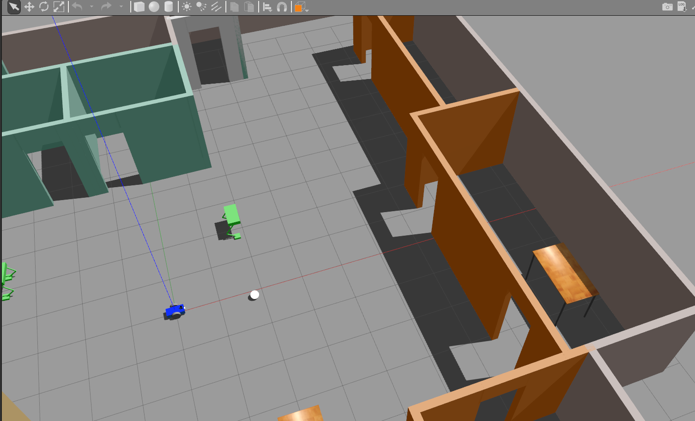

# track_robot

This is a ros package for learning ROS which contains the following:

* _urdf_ for a simple differential drive robot
* a gazebo simulation world 

This package is used along with _ball_chaser_ package for the robot to chase a ball which is infront of it.

## Usage

clone the repository to a ROS catkin workspace and build it.

`roslaunch track_robot world.launch`

this will spawn the robot in the gazebo world

tested on Gazebo 9.0.0